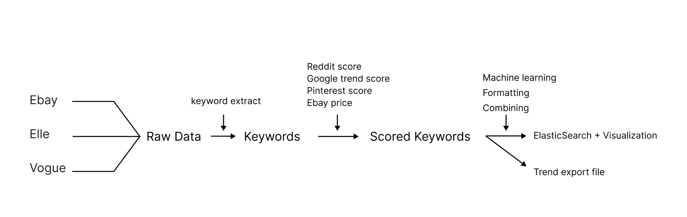
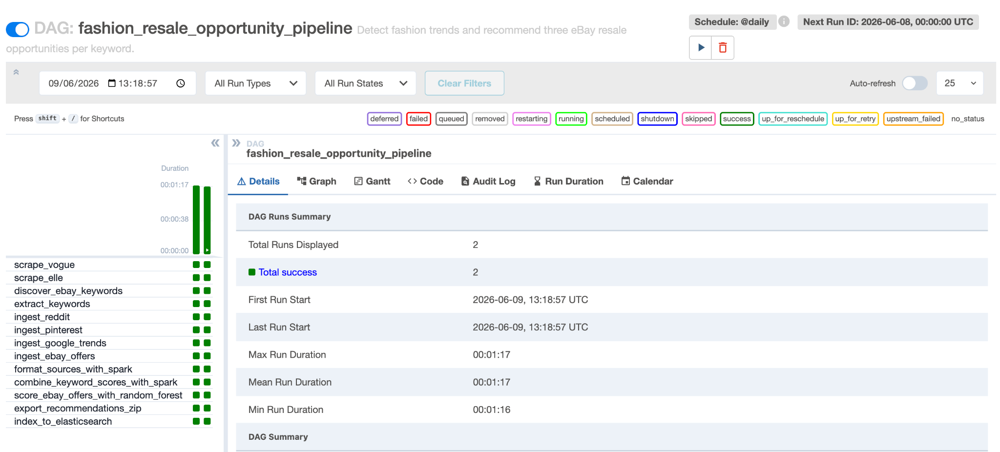
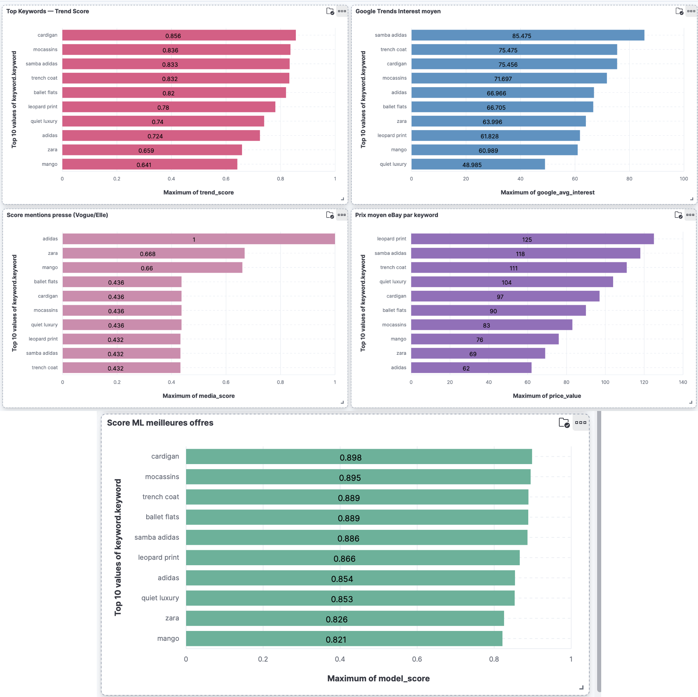

# Fashion Resale Trends

Big Data project for the II.2314 Advanced Database course at ISEP (June 2026), by Danae Zabala and Grégoire Sartorius.

**Stack:** Python · Apache Airflow · PySpark · MinIO (S3) · Elasticsearch · Kibana · scikit-learn · Docker

Fashion trends change very fast, and today they are not only created by big brands but also by vintage resellers on second-hand platforms. Detecting emerging trends is getting harder and harder. With this project we built a pipeline that detects emerging fashion trends and turns them into recommendations for reselling, but also for buying the latest trends at the best price.

The question we tried to answer:

**Can we predict which fashion trend will go viral on the resale market by combining social media metrics and search interest?**

## Data sources

Good fashion data is hard to collect, especially when you want emerging trends and not the ones that are already everywhere. We did not want data from big brands because they are already late on trends, so we looked for sources where trends appear early:

- Fashion magazines: we scrape article titles from French and European media (Vogue, Elle, Grazia, Madame Figaro...) plus streetwear media (Hypebeast, Highsnobiety)
- Reddit: posts from 8 subreddits (r/fashion, r/streetwear, r/sneakers, r/femalefashionadvice, r/malefashionadvice, r/frugalmalefashion, r/femalefashion, r/womensfashion)
- Google Trends, through PyTrends: search interest over time for each keyword
- eBay API: listing titles and prices
- Vinted: second-hand listings

All these APIs are pretty unstable and often change their policy or rate limits. That's why we use fixtures, so the pipeline still runs when an API call fails.

## Pipeline

Everything is orchestrated by one Airflow DAG, `dags/fashion_resale_opportunity_pipeline.py`, that runs daily. It works in 4 phases:

1. **Raw ingestion**: we scrape media titles and marketplace listing titles. Everything is stored as JSON in the raw layer of the data lake.
2. **Keyword extraction**: our whole work depends on having relevant keywords, so we extract them from the raw text with a custom process that only keeps fashion keywords.
3. **Multi-source ingestion**: with these keywords we fetch more data (Google Trends interest, Reddit post counts, eBay prices...) to get more parameters to score the trends.
4. **Formatting, aggregation, ML and export**: Spark normalises the raw JSON into Parquet and CSV (timestamps in UTC), then combines all the source scores per keyword. A Random Forest gives a resale opportunity score to each eBay offer. Final results are exported as a ZIP and indexed into Elasticsearch for the Kibana dashboard.





The data lake is local and mirrored in MinIO:

| Layer     | Content                                  |
|-----------|------------------------------------------|
| raw       | Original ingested JSON                   |
| formatted | Cleaned and normalised Parquet and CSV   |
| combined  | Aggregated multi-source scores           |
| ml        | Machine learning output                  |
| exports   | Final ZIP and CSV files                  |

## How we find the trends

**Seeds are just a bootstrap.** `config/seed_keywords.yml` contains 16 fashion terms we picked by hand. They are only there for the first run, when the data lake is empty: they give the pipeline its first keywords and the first eBay queries, with a +3 bonus so they show up in the early rankings. After that they don't drive the discovery anymore.

**Automatic discovery.** Then the pipeline finds new terms by itself:

1. It collects article titles from the fashion media, where new aesthetics, garments and micro-trends often show up first.
2. In parallel it takes eBay listing titles, which are good for product-level trends (mesh flats, Samba Adidas, cardigan...).
3. `candidate_phrases()` in `keywords.py` generates all unigrams, bigrams and trigrams from each title. For example from "gorpcore s'invite dans les défilés printemps 2026" we get `gorpcore`, `défilés printemps`, `printemps 2026`...
4. `useful_keyword()` keeps a candidate only if at least one word is in our fashion vocabulary (`config/fashion_vocabulary.yml`, garments, materials, aesthetics, silhouettes, brands). This removes the noise like verbs, dates or generic words.
5. Each keyword gets a score: +2 per media article mention, +1 per eBay title mention, +3 for seeds.

Example: if "gorpcore" appears in 8 articles it gets 8 × 2 = 16 points, while a seed like "mesh flats" that is in no article only keeps its +3. So gorpcore goes above mesh flats even if it was never in the seed list. Seeds help the pipeline start, but they don't decide the trends.

## Results



On our runs, cardigan, mocassins, trench coat and Samba Adidas were in the top positions on most metrics. Samba Adidas had a very high Google Trends interest and good resale prices, and leopard print had the highest resale price even with a moderate search interest (niche but valuable demand). Brands dominate media mentions, while products dominate search and resale. The ML score is well aligned with the multi-source trend score.

## Run it

You need Docker. Copy the env file and fill in your eBay and Reddit keys:

```bash
cp .env.example .env
docker compose up -d --build
```

Then:

- Airflow: http://localhost:8085 (admin / admin), trigger the `fashion_resale_opportunity_pipeline` DAG
- MinIO: http://localhost:9003 (minioadmin / minioadmin)
- Kibana: http://localhost:5602, the dashboard can be created with `python scripts/create_kibana_dashboard.py`
- Spark master UI: http://localhost:8090

If you don't have API keys, set `USE_FIXTURES_IF_SOURCE_FAIL=true` to run with the fixtures.

Tests:

```bash
pip install -r requirements-dev.txt
pytest
```

## Limitations and future work

- No TikTok or Instagram data. Today that's where micro-trends are born, so it's the biggest blind spot of the project.
- Media scraping depends on HTML structures that change often, and many fashion sites have no stable RSS feed, so ingestion can break without warning.
- Because of the API instability, the pipeline relies on fixtures for eBay offers to stay reproducible.

Next steps would be to replace the manual trend score with a model trained on historical data, extend the fashion vocabulary to catch more niche aesthetics, and add real-time monitoring and alerting to react to API failures or sudden spikes in trend signals.

## Sources

- Vogue France: https://www.vogue.fr
- Elle: https://www.elle.fr
- PyTrends: https://github.com/GeneralMills/pytrends
- ThredUp 2026 Resale Report: https://cf-assets-tup.thredup.com/resale_report/2026/ThredUp_Resale_Report_2026.pdf
